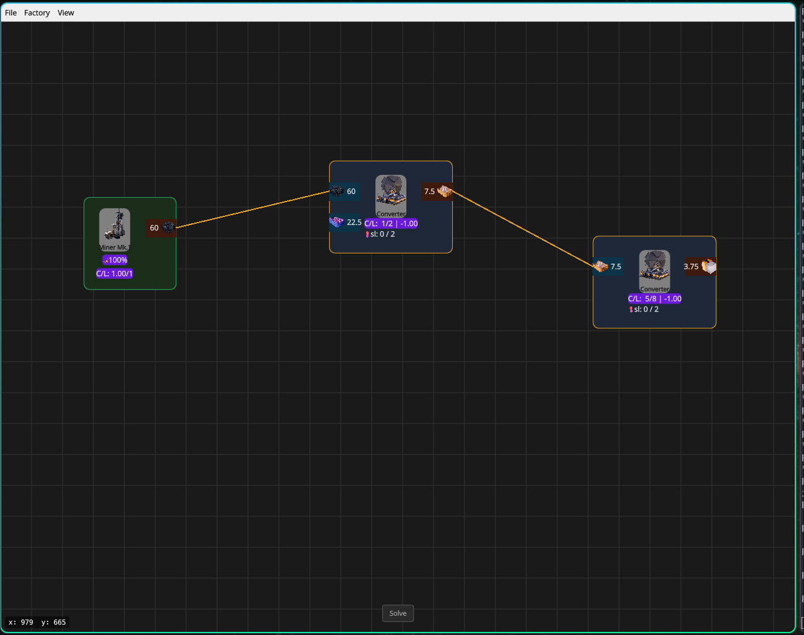

# Satisfactosim

Satisfactosim is a work-in-progress desktop tool for designing and calculating production chains in [Satisfactory](https://www.satisfactorygame.com/). It provides a node-based workspace where extractors, production machines, splitters, and nested factories can be connected into a factory plan.



## Features

- Visual node-based factory editor
- Production and extraction recipes loaded from game data
- Automatic calculation of machine counts and item flow rates
- Exact fractional calculations using Boost.Rational
- Support for overclocking, resource purity, machine tiers, and Somersloops
- Weighted splitters
- Nested factories with input and output boundary nodes
- Save and load factory plans as JSON
- Headless CLI mode for working with factory graphs from a terminal

## How it works

Factories are represented as graphs of machines, ports, and connections. Connected production chains are separated into independent groups, then converted into systems of linear equations. A Gaussian-elimination solver calculates the machine counts and flow rates required to keep each chain balanced.

The application is split into three main parts:

- `src/core` contains the factory model, game-data library, session management, persistence, and solver.
- `src/gui` contains the QML interface and the C++ models exposed to it.
- `assets/scripts/parser.py` converts data exported by Satisfactory into the smaller JSON files used by the application.

## Building

### Requirements

- A C++20 compiler
- CMake 3.16 or newer
- Qt 6 with Widgets, Quick, QML, and Charts
- Boost

Clone the repository, then run:

```bash
cmake -S . -B build
cmake --build build
./build/FactoryApp
```

For Nix users, the included development shell provides the required dependencies:

```bash
nix-shell
cmake -S . -B build
cmake --build build
./build/FactoryApp
```

The application also has a headless mode:

```bash
./build/FactoryApp --headless
```

## Current status

Satisfactosim is under active development. The main editing, calculation, nested-factory, and save/load workflows are implemented, but the interface and solver are still evolving. There are currently no packaged releases or automated tests.

### Game data and icons

Satisfactosim does not grant a license to any Satisfactory data or artwork. These assets are separate from the GPL-licensed source code and must be obtained from a source you are legally permitted to use.

The repository currently includes the reduced JSON files used at runtime. To regenerate or update them:

1. Export or obtain `Docs.json` from your local Satisfactory installation.
2. Place it at `assets/jsons/Docs.json`. This file is intentionally ignored by Git.
3. Run `python3 assets/scripts/parser.py` from the repository root.

Item and machine icons are not included. Supply your own legally obtained PNG files under `assets/icons/items` and `assets/icons/machines`. The application still builds without them, but images will be missing. A better first-run asset setup is planned.

## Planned work

- Improve solver validation and error reporting
- Add automated tests for graph operations, serialization, and production calculations
- Improve ownership and lifecycle handling in the core model
- Add power-consumption summaries
- Add undo and redo support
- Package QML and other runtime assets for distributable builds

## Disclaimer

This is an unofficial fan project and is not affiliated with or endorsed by Coffee Stain Studios. Satisfactory and its related names and assets belong to their respective owners.

## License

The original source code in this repository is licensed under the [GNU General Public License v3.0 or later](LICENSE). This license does not cover Satisfactory game data, names, icons, or other third-party assets.
